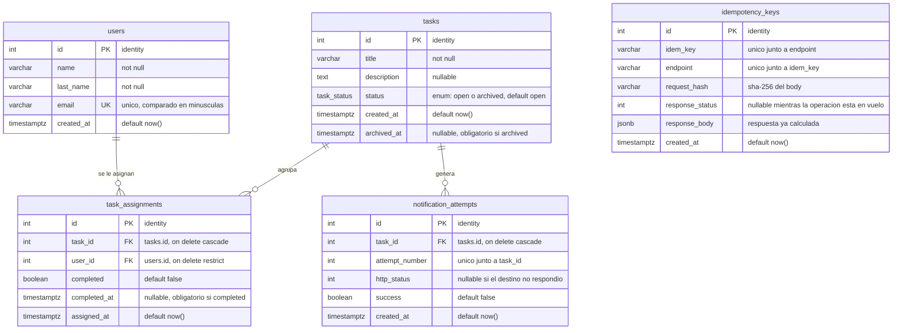

# Reto GEEST — API de gestión de tareas

API REST para crear tareas, asignarlas a varias personas y archivarlas automáticamente cuando todas completan su parte, notificando a un sistema externo.

**Stack:** Node.js 20 · TypeScript · Express · PostgreSQL 16 · Jest

> URL pública: _pendiente de despliegue_

---

## Ejecutar localmente

Requisitos: Node >= 20, npm >= 10 y Docker.

```bash
git clone <url-del-repositorio>
cd Reto_Backend_Geest
npm install
cp .env.example .env
docker compose up -d
npm run migrate
npm run dev
```

La API queda en `http://localhost:3000`. Comprobar:

```bash
curl http://localhost:3000/health
```

### Comandos

| Comando | Descripción |
|---|---|
| `npm run dev` | Desarrollo con recarga automática |
| `npm test` | **Tests automatizados** |
| `npm run migrate` | Aplica las migraciones pendientes |
| `npm run build` / `npm start` | Compila / ejecuta la versión compilada |

### Variables de entorno

Se copian de `.env.example`. `DATABASE_URL`, `NOTIFY_URL` y `API_KEY` son obligatorias y se validan al arrancar.

| Variable | Descripción |
|---|---|
| `DATABASE_URL` | Conexión a PostgreSQL |
| `NOTIFY_URL` | Webhook externo notificado al archivar una tarea |
| `API_KEY` | Clave de acceso a la API (header `x-api-key`) |
| `PORT` · `NODE_ENV` · `DATABASE_SSL` | Opcionales, con valor por defecto |

---

## Endpoints

| Método | Ruta | Descripción |
|---|---|---|
| `POST` | `/users` | Registra un usuario. Valida email y campos obligatorios |
| `GET` | `/users` | Usuarios con sus tareas pendientes |
| `POST` | `/tasks` | Registra una tarea con estado `open` |
| `GET` | `/tasks` | Tareas con sus asignados. Acepta `?status=open\|archived` |
| `GET` | `/tasks/:idTask` | Detalle de una tarea y quién completó su parte |
| `GET` | `/health` | Estado del servicio y de la base (infraestructura) |

Pendientes de implementar: `POST /tasks/:idTask/assign`, `POST /tasks/:idTask/complete`, `GET /users/:idUser/tasks`, `GET /tasks/:idTask/notifications`.

Los errores siempre responden con la misma forma:

```json
{ "error": { "code": "VALIDATION_ERROR", "message": "email: no es un correo electronico valido" } }
```

---

## Modelo de datos

El esquema está versionado como migraciones SQL en [`migrations/`](migrations/), aplicadas en orden por `npm run migrate`.



`task_assignments` es la tabla central: resuelve la relación muchos-a-muchos y guarda el completado **por persona y por tarea**. `idempotency_keys` no tiene relaciones porque es infraestructura transversal a todos los `POST`.

---

## Decisiones técnicas

**PostgreSQL sobre SQLite.** El reto exige escrituras concurrentes correctas (dos usuarios completando a la vez). SQLite serializa con un lock global de escritura; Postgres ofrece `SELECT … FOR UPDATE` a nivel de fila, que es la herramienta exacta para archivar exactamente una vez.

**Sin ORM: driver `pg` y SQL a mano.** El núcleo del reto es control transaccional fino (locks de fila, `ON CONFLICT`). Un ORM oculta justo eso y obligaría a escribir SQL crudo en los puntos críticos de todos modos.

**Migraciones SQL planas con ejecutor propio** (~60 líneas, `src/db/migrate.ts`). Cumple el requisito de esquema versionado sin sumar una dependencia. Aplica solo lo pendiente, cada archivo en su transacción, y registra lo aplicado en `schema_migrations`.

**`status` como `ENUM` y no `VARCHAR`.** La integridad la garantiza la base, no la disciplina del código.

**Las reglas críticas viven en la base, no solo en el servicio.** `UNIQUE (task_id, user_id)` impide duplicar la asignación aunque lleguen requests en paralelo — un `SELECT` previo no lo lograría. `UNIQUE (idem_key, endpoint)` es lo que hace que dos requests simultáneos con la misma `Idempotency-Key` colisionen al insertar en vez de ejecutarse dos veces. `UNIQUE (task_id, attempt_number)` impide registrar dos veces el mismo intento de notificación.

**Restricciones `CHECK` que hacen imposible el estado inconsistente.** Una tarea `archived` siempre tiene `archived_at`; una `open` nunca lo tiene. Igual para `completed` / `completed_at`. Un archivado a medias no puede existir ni por error de código.

**Unicidad de email insensible a mayúsculas** (índice sobre `lower(email)`). `Mario@x.com` y `mario@x.com` son la misma persona.

**Lecturas agregadas en una sola consulta.** `GET /users` y `GET /tasks` construyen sus arreglos anidados con `jsonb_agg` en la base, en vez de consultar las relaciones por cada fila. Evita el problema N+1 sin añadir un ORM.

---

## Supuestos

- **La notificación externa no se desarrolla.** `NOTIFY_URL` apunta a un endpoint de prueba (webhook.site) para demostrar los reintentos, tal como permite el enunciado.
- **Una tarea sin usuarios asignados nunca se archiva sola.** El archivado solo se evalúa al completar una parte; sin asignados no hay nada que completar.
- **El archivado no se revierte.** No existe endpoint para reabrir una tarea ni el enunciado lo pide.
- **`status` se almacena, no se deriva** de las asignaciones. Es una desnormalización deliberada: archivar dispara un efecto externo (la notificación) y necesita ser una transición bloqueable para garantizar el "exactamente una vez".
- Un usuario con tareas asignadas no puede borrarse (`ON DELETE RESTRICT`): perdería el histórico y alteraría el conteo de completados.

---

## Alcance y recortes

_Se completará al cierre del reto._

---

## Extra

_Se completará al implementarlo._

---

## Despliegue

_Se completará al desplegar._
