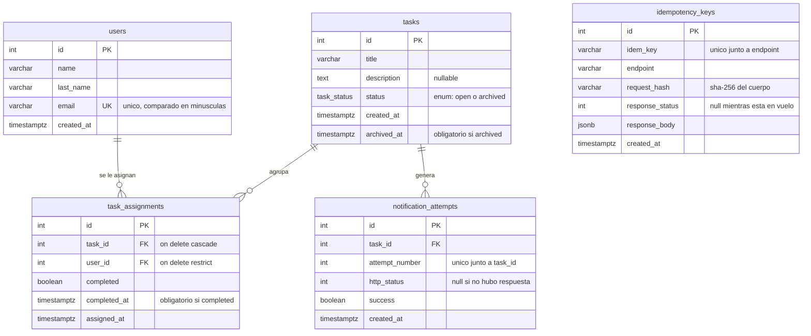

# Reto GEEST — API de gestión de tareas

API REST que crea tareas, las asigna a varias personas y las archiva automáticamente cuando todas completan su parte, notificando a un sistema externo.

**Stack:** Node.js 20 · TypeScript · Express · PostgreSQL 16 · Jest

## API desplegada

```
https://retobackendgeest-production.up.railway.app
```

Los endpoints de negocio exigen el header `x-api-key`. Clave de evaluación, válida durante la ventana de 7 días:

```bash
curl -H "x-api-key: 22f9f7d6f2c5f15eaff9115b3872bf0fea5250d7dc3562bf" \
  https://retobackendgeest-production.up.railway.app/users
```

`GET /health` es público. Para probar sin configurar nada, importa [`postman_collection.json`](postman_collection.json) en Postman: trae los endpoints, sus casos de error y la clave ya configurada.

**Verificar las notificaciones** no requiere acceder al sistema externo: cada intento queda registrado y se consulta con `GET /tasks/:idTask/notifications` (número de intento, timestamp, status HTTP y si tuvo éxito).

## Ejecutar localmente

Requisitos: Node >= 20, npm >= 10 y Docker.

```bash
git clone https://github.com/MarioGaytan/Reto_Backend_Geest.git
cd Reto_Backend_Geest
npm install
cp .env.example .env
docker compose up -d     # PostgreSQL 16
npm run migrate          # aplica el esquema
npm run dev              # http://localhost:3000
```

**Tests:** `npm test` (85 tests; requiere `docker compose up -d`). La suite usa su propia base `geest_test`, que recrea y migra en cada ejecución, y levanta un servidor local que hace de destino de `NOTIFY_URL` para forzar `5xx`, `4xx` y caídas y verificar los reintentos sin depender de internet. Su configuración está en `.env.test`, versionada a propósito: no contiene secretos.

Otros comandos: `npm run build` y `npm start` (versión compilada), `npm run migrate:prod`.

**Variables de entorno** (se copian de `.env.example`): `DATABASE_URL`, `NOTIFY_URL` y `API_KEY` son obligatorias y se validan al arrancar; `PORT`, `NODE_ENV` y `DATABASE_SSL` tienen valor por defecto.

## Endpoints

| Método | Ruta | Descripción |
|---|---|---|
| `POST` | `/users` | Registra un usuario. Valida email y campos obligatorios |
| `GET` | `/users` | Usuarios con sus tareas pendientes |
| `GET` | `/users/:idUser/tasks` | Tareas del usuario, indicando si completó su parte |
| `POST` | `/tasks` | Registra una tarea con estado `open` |
| `GET` | `/tasks` | Tareas con sus asignados. Acepta `?status=open\|archived` |
| `GET` | `/tasks/:idTask` | Detalle de la tarea y quién completó su parte |
| `POST` | `/tasks/:idTask/assign` | Asigna usuarios sin duplicar la relación |
| `POST` | `/tasks/:idTask/complete` | Marca la parte del usuario; archiva si ya no queda nadie |
| `GET` | `/tasks/:idTask/notifications` | Intentos de notificación de esa tarea |
| `GET` | `/health` | Estado del servicio y de la base (público) |

Todos los `POST` aceptan `Idempotency-Key`: con la misma llave y el mismo cuerpo la operación se ejecuta una sola vez y ambas respuestas son idénticas, incluso en paralelo; con la misma llave y un cuerpo distinto se responde `422`. Los errores siempre tienen la forma `{ "error": { "code", "message" } }`.

## Modelo de datos

Esquema versionado como migraciones SQL en [`migrations/`](migrations/).



Si el diagrama no se ve renderizado, está también en [`docs/modelo-datos.svg`](docs/modelo-datos.svg).

`task_assignments` es la tabla central: resuelve el muchos-a-muchos y guarda el completado **por persona y por tarea**. `idempotency_keys` no tiene relaciones porque es infraestructura transversal a todos los `POST`.

## Decisiones técnicas

**PostgreSQL sobre SQLite.** El reto exige que dos usuarios completen la última parte a la vez y la tarea se archive exactamente una vez. Eso pide un lock pesimista de fila (`SELECT … FOR UPDATE`), que SQLite no tiene.

**Sin ORM: driver `pg` y SQL a mano.** El núcleo es control transaccional fino (locks de fila, `ON CONFLICT`); un ORM oculta justo eso y obligaría a escribir SQL crudo en los puntos críticos igualmente. **Migraciones SQL planas** con un ejecutor propio de ~60 líneas, que aplica solo lo pendiente y registra lo aplicado en `schema_migrations`.

**Las garantías viven en la base, no en el código.** `UNIQUE (task_id, user_id)` impide duplicar la asignación aunque lleguen peticiones en paralelo — un `SELECT` previo no lo lograría. `UNIQUE (idem_key, endpoint)` hace que dos peticiones simultáneas con la misma `Idempotency-Key` colisionen al insertar en vez de ejecutarse dos veces. Y las restricciones `CHECK` hacen irrepresentable el estado inconsistente: una tarea `archived` siempre tiene `archived_at`, una `open` nunca.

**Archivado y notificación exactamente una vez.** `/complete` abre una transacción que empieza bloqueando la fila de la tarea con `SELECT … FOR UPDATE`, y dentro de ese lock marca la parte del usuario, cuenta las pendientes y archiva si no queda ninguna. Si los dos últimos asignados completan a la vez, el lock las serializa: la primera aún ve una parte pendiente y no archiva; la segunda ya cuenta cero y realiza la transición. Solo una puede observar el conteo en cero, así que solo una archiva y solo una notifica.

**La notificación se envía fuera de la transacción.** Los reintentos con backoff tardan segundos y mantendrían el lock bloqueando al resto. Se espera solo al primer intento y los reintentos siguen en segundo plano. Cada intento se registra **antes** de lanzar la petición, así queda constancia aunque el proceso muera. Hasta 3 intentos con esperas de 1 s y 2 s ante `5xx` o ausencia de respuesta; un `4xx` no se reintenta porque el destino entendió y rechazó.

**Lecturas sin N+1.** `GET /users` y `GET /tasks` construyen sus arreglos anidados con `jsonb_agg` en una sola consulta.

## Supuestos

- **La notificación externa no se desarrolla.** `NOTIFY_URL` apunta a un endpoint de prueba, como permite el enunciado. La verificación no depende de ese destino: los intentos se consultan en `GET /tasks/:idTask/notifications`.
- **No hay contraseñas ni sesiones.** El contrato no las contempla: `POST /users` no recibe contraseña y `/complete` recibe el `userId` en el cuerpo. Se interpreta como una API máquina-a-máquina: la API Key autentica al sistema, el `userId` identifica a la persona.
- **Una tarea sin asignados nunca se archiva sola**, y **el archivado no se revierte**: asignar a una tarea archivada devuelve `409`, porque dejaría una parte pendiente que nada volvería a cerrar.
- **Completar dos veces no es error.** Responde éxito sin alterar el `completedAt` original, que es lo esperado ante un doble clic.
- **`status` se almacena, no se deriva.** Desnormalización deliberada: archivar dispara un efecto externo y necesita ser una transición bloqueable.
- Un usuario con tareas asignadas no puede borrarse (`ON DELETE RESTRICT`).

## Extra: autenticación por API Key

**Qué problema resuelve.** Sin autenticación la API está abierta: cualquiera con la URL puede crear y archivar tareas, y leer nombres y correos con un `GET /users`. Hay además un abuso menos evidente: al archivar, la API hace un `POST` saliente a `NOTIFY_URL`, así que archivar tareas en bucle convierte el servicio en un amplificador de tráfico contra un tercero, desde esta IP.

**Por qué era necesaria.** Es el único hueco que impediría desplegar esto en producción; las demás mejoras posibles optimizan un servicio que funciona.

**Por qué sobre otras alternativas.** *JWT por usuario* contradice el contrato: no hay contraseñas y el `userId` viaja en el cuerpo; habría exigido columnas fuera del modelo y alterado la funcionalidad requerida. *Rate limiting* trata el síntoma: limitar peticiones sin autenticar sigue permitiendo que cualquiera escriba. *Paginación* es escalabilidad, no un hueco del producto.

**Cómo funciona.** Un middleware compara `x-api-key` con la variable `API_KEY` mediante `crypto.timingSafeEqual`, para que la latencia no revele la clave carácter a carácter; acepta también `Authorization: Bearer`. Responde `401` con el formato de error estándar. No cubre `/health`: un healthcheck autenticado haría que el proveedor diera el despliegue por muerto y reiniciara el contenedor en bucle.

## Despliegue

**Dónde:** [Railway](https://railway.app), con dos servicios en el mismo proyecto — la API y PostgreSQL 16.

**Por qué:** la base no se suspende por inactividad, a diferencia de los planes gratuitos de otros proveedores, y la evaluación dura 7 días. Ambos servicios se comunican por la **red privada** (`postgres.railway.internal`): la base no expone puerto público, así que el único camino a los datos es la API, que a su vez exige la API Key. El despliegue se dispara desde GitHub y `railway.json` fija el healthcheck en `/health` y ejecuta las migraciones antes de arrancar.

**Cómo acceder:** URL y clave al principio de este documento.

## Recortes

- **Patrón outbox para las notificaciones.** Si el proceso muere entre el `COMMIT` y el envío, la notificación se pierde. Lo correcto sería registrar la intención de notificar en la misma transacción que archiva y que un worker la consuma; exige proceso aparte, control de concurrencia y política de limpieza.
- **Limpieza de `idempotency_keys`.** Las llaves se acumulan; falta un proceso que purgue las antiguas. El índice sobre `created_at` ya está creado para ello.
- **Paginación en los listados.** `GET /users` y `GET /tasks` devuelven todo; con volumen real haría falta `?page=&limit=`.
- **Rollback de migraciones.** El ejecutor solo avanza: en desarrollo se recrea la base, en producción se escribiría una migración correctiva.
