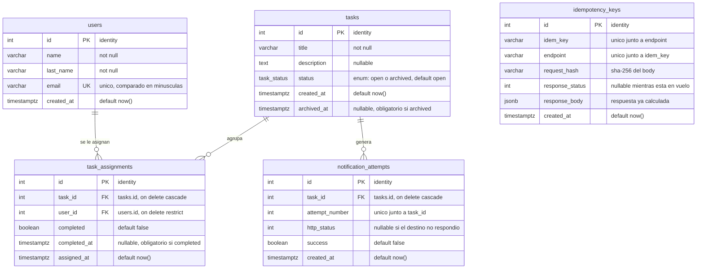

# Reto GEEST — API de gestión de tareas

API REST para crear tareas, asignarlas a varias personas y archivarlas automáticamente cuando todas completan su parte, notificando a un sistema externo.

**Stack:** Node.js 20 · TypeScript · Express · PostgreSQL 16 · Jest

## API desplegada

```
https://retobackendgeest-production.up.railway.app
```

Todos los endpoints de negocio exigen el header `x-api-key`. Clave de evaluación, válida durante la ventana de 7 días:

```
22f9f7d6f2c5f15eaff9115b3872bf0fea5250d7dc3562bf
```

```bash
curl -H "x-api-key: 22f9f7d6f2c5f15eaff9115b3872bf0fea5250d7dc3562bf" \
  https://retobackendgeest-production.up.railway.app/users
```

`GET /health` es público y no requiere clave.

---

## Ejecutar localmente

Requisitos: Node >= 20, npm >= 10 y Docker.

```bash
git clone https://github.com/MarioGaytan/Reto_Backend_Geest.git
cd Reto_Backend_Geest
npm install
cp .env.example .env
docker compose up -d
npm run migrate
npm run dev
```

La API queda en `http://localhost:3000`. Comprobar con `curl http://localhost:3000/health`.

### Tests

```bash
npm test
```

85 tests. Requiere la base levantada (`docker compose up -d`). La suite usa su propia base `geest_test`, que recrea y migra en cada ejecución, y levanta un servidor local que hace de destino de `NOTIFY_URL` para forzar respuestas `5xx`, `4xx` y caídas y verificar los reintentos sin depender de internet. Su configuración está en `.env.test`, versionada a propósito: no contiene secretos.

### Comandos

| Comando | Descripción |
|---|---|
| `npm run dev` | Desarrollo con recarga automática |
| `npm test` | Tests automatizados |
| `npm run migrate` | Aplica las migraciones pendientes |
| `npm run build` · `npm start` | Compila · ejecuta la versión compilada |

### Variables de entorno

Se copian de `.env.example`. `DATABASE_URL`, `NOTIFY_URL` y `API_KEY` son obligatorias y se validan al arrancar.

| Variable | Descripción |
|---|---|
| `DATABASE_URL` | Conexión a PostgreSQL |
| `NOTIFY_URL` | Webhook externo notificado al archivar |
| `API_KEY` | Clave de acceso (header `x-api-key`) |
| `PORT` · `NODE_ENV` · `DATABASE_SSL` | Opcionales, con valor por defecto |

---

## Endpoints

| Método | Ruta | Descripción |
|---|---|---|
| `POST` | `/users` | Registra un usuario. Valida email y campos obligatorios |
| `GET` | `/users` | Usuarios con sus tareas pendientes |
| `GET` | `/users/:idUser/tasks` | Tareas del usuario, indicando si completó su parte |
| `POST` | `/tasks` | Registra una tarea con estado `open` |
| `GET` | `/tasks` | Tareas con sus asignados. Acepta `?status=open\|archived` |
| `GET` | `/tasks/:idTask` | Detalle de la tarea y quién completó su parte |
| `POST` | `/tasks/:idTask/assign` | Asigna usuarios sin duplicar la relación |
| `POST` | `/tasks/:idTask/complete` | Marca la parte del usuario; archiva si ya no queda nadie |
| `GET` | `/tasks/:idTask/notifications` | Intentos de notificación de esa tarea |
| `GET` | `/health` | Estado del servicio y de la base (público) |

Todos los `POST` aceptan el header `Idempotency-Key`. Con la misma llave y el mismo cuerpo la operación se ejecuta una sola vez y ambas respuestas son idénticas, incluso en paralelo; con la misma llave y un cuerpo distinto se responde `422`.

Los errores siempre responden con la misma forma:

```json
{ "error": { "code": "VALIDATION_ERROR", "message": "email: no es un correo electronico valido" } }
```

---

## Modelo de datos

Esquema versionado como migraciones SQL en [`migrations/`](migrations/).



`task_assignments` es la tabla central: resuelve la relación muchos-a-muchos y guarda el completado **por persona y por tarea**. `idempotency_keys` no tiene relaciones porque es infraestructura transversal a todos los `POST`.

---

## Decisiones técnicas

**PostgreSQL sobre SQLite.** El reto exige que dos usuarios completen la última parte a la vez y la tarea se archive exactamente una vez. Eso pide un lock pesimista de fila (`SELECT … FOR UPDATE`), que SQLite no tiene: serializa con un lock global de escritura.

**Sin ORM: driver `pg` y SQL a mano.** El núcleo del reto es control transaccional fino (locks de fila, `ON CONFLICT`). Un ORM oculta justo eso y obligaría a escribir SQL crudo en los puntos críticos de todos modos.

**Migraciones SQL planas con ejecutor propio** (~60 líneas). Cumple el requisito de esquema versionado sin sumar dependencias: aplica solo lo pendiente, cada archivo en su transacción, y registra lo aplicado en `schema_migrations`.

**Las reglas críticas viven en la base.** `UNIQUE (task_id, user_id)` impide duplicar la asignación aunque lleguen requests en paralelo — un `SELECT` previo no lo lograría. `UNIQUE (idem_key, endpoint)` hace que dos requests simultáneos con la misma `Idempotency-Key` colisionen al insertar en vez de ejecutarse dos veces. `UNIQUE (task_id, attempt_number)` impide registrar dos veces el mismo intento.

**Restricciones `CHECK` que hacen imposible el estado inconsistente.** Una tarea `archived` siempre tiene `archived_at`; una `open` nunca. Igual para `completed`/`completed_at`.

**Archivado y notificación exactamente una vez.** `/complete` abre una transacción que empieza bloqueando la fila de la tarea. Si los dos últimos asignados completan a la vez, el segundo espera, ve la tarea archivada y no repite la transición; como solo esa transacción realiza el cambio, solo ella notifica.

**La notificación se envía fuera de la transacción.** Los reintentos con backoff tardan segundos y mantendrían el lock bloqueando al resto. Se espera solo al primer intento; los reintentos siguen en segundo plano. Cada intento se registra **antes** de lanzar la petición, así queda constancia aunque el proceso muera. Hasta 3 intentos con esperas de 1 s y 2 s ante `5xx` o ausencia de respuesta; un `4xx` no se reintenta.

**Lecturas sin N+1.** `GET /users` y `GET /tasks` construyen sus arreglos anidados con `jsonb_agg` en una sola consulta.

---

## Supuestos

- **La notificación externa no se desarrolla.** `NOTIFY_URL` apunta a un endpoint de prueba, tal como permite el enunciado.
- **No hay contraseñas ni sesiones.** El contrato no las contempla: `POST /users` no recibe contraseña y `/complete` recibe el `userId` en el cuerpo. Se interpreta como una API máquina-a-máquina donde el cliente afirma en nombre de quién actúa; la API Key autentica al sistema, el `userId` identifica a la persona.
- **Una tarea sin asignados nunca se archiva sola.** El archivado solo se evalúa al completar una parte.
- **El archivado no se revierte** y **asignar a una tarea archivada devuelve `409`**: dejaría una parte pendiente que nada volvería a cerrar.
- **Completar dos veces no es error.** Responde éxito sin alterar el `completedAt` original, que es lo esperado ante un doble clic.
- **`status` se almacena, no se deriva.** Desnormalización deliberada: archivar dispara un efecto externo y necesita ser una transición bloqueable.
- Un usuario con tareas asignadas no puede borrarse (`ON DELETE RESTRICT`).

---

## Extra: autenticación por API Key

**Qué problema resuelve.** Sin autenticación la API está abierta: cualquiera que descubra la URL puede crear, asignar y archivar tareas, y leer nombres y correos con un `GET /users`. Hay además un abuso menos evidente: al archivar, la API hace un `POST` saliente a `NOTIFY_URL`, así que archivar tareas en bucle convierte el servicio en un amplificador de tráfico contra un tercero, desde esta IP.

**Por qué era necesaria.** Es el único hueco que impediría desplegar esto en producción. Las demás mejoras posibles optimizan un servicio que funciona; esta cierra uno que no debería estar expuesto.

**Por qué sobre otras alternativas.** *JWT por usuario* contradice el contrato: no hay contraseñas y el `userId` viaja en el cuerpo; habría exigido columnas fuera del modelo y alterado la funcionalidad requerida. *Rate limiting* trata el síntoma: limitar peticiones sin autenticar sigue permitiendo que cualquiera escriba. *Paginación* es escalabilidad, no un hueco del producto.

**Cómo funciona.** Un middleware compara `x-api-key` con la variable `API_KEY` mediante `crypto.timingSafeEqual`, para que la latencia no revele la clave carácter a carácter; acepta también `Authorization: Bearer`. Responde `401` con el formato de error estándar. No se aplica a `/health`: un healthcheck autenticado haría que el proveedor diera el despliegue por muerto y reiniciara el contenedor en bucle.

---

## Despliegue

**Dónde.** [Railway](https://railway.app), con dos servicios en el mismo proyecto: la API y PostgreSQL 16.

**Por qué.** La base de datos no se suspende por inactividad, a diferencia de los planes gratuitos de otros proveedores, y la evaluación dura 7 días. Se conectan por la **red privada** del proyecto (`postgres.railway.internal`): la base no expone puerto público, así que el único camino a los datos es la API, que a su vez exige la API Key. El despliegue se dispara desde GitHub y `railway.json` fija el healthcheck en `/health` y ejecuta las migraciones antes de arrancar.

**Cómo acceder.** URL y clave al principio de este documento.

---

## Recortes

- **Patrón outbox para las notificaciones.** Si el proceso muere entre el `COMMIT` y el envío, la notificación se pierde. Lo correcto sería registrar la intención de notificar en la misma transacción que archiva y que un worker la consuma. Exige proceso aparte, control de concurrencia entre workers y política de limpieza.
- **Limpieza de `idempotency_keys`.** Las llaves se acumulan; falta un proceso periódico que purgue las antiguas. El índice sobre `created_at` ya está creado para ello.
- **Paginación en los listados.** `GET /users` y `GET /tasks` devuelven todo. Con volumen real haría falta `?page=&limit=`.
- **Rollback de migraciones.** El ejecutor solo avanza. En desarrollo se recrea la base; en producción se escribiría una migración correctiva.
